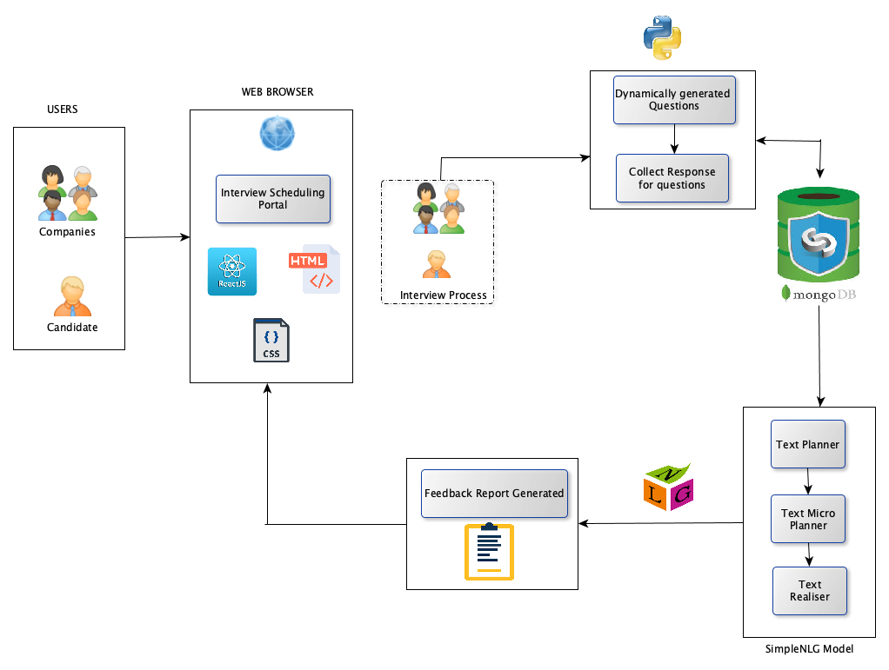

# Feed-Me-Back

# ABSTRACT 
Everyday thousands of people struggle to find the right job because of which they appear for several rounds of interviews. After going through a hectic process of technical and HR inteviews, many get rejections by the end of the day. Rejection leads to a situation where candidates question their skills and abilities. The Feed-Me-Back web portal will be designed to help such candidates to get a performance feedback report at the end of the day to know what went wrong with interview process. The report will reflect on skills that person could improve on so that they will be well prepared for other upcoming interviews. In the web portal, startup companies can schedule an interview for the candidate and after the interview, interviewers can provide their response to survey questions which will be dynamically generated based on resume and job requirements. Based on the feedback response, we will generate a performance report which will be analyzed in aggregate for a user using Natural language Generation.

# ARCHITECTURE DIAGRAM

# TECHNOLOGY STACK
Machine Learning Model : Natural Language Generation using SimpleNLG  
Programming Languages : Java, Python  
Database : MongoDB  
Web Development : ReactJS, HTML, CSS

# Feedback
Professor Ranjan's Feedback:

I would rather make it an interview preparation app where interview will be scheduled and interviewer will provide feedback which will be analyzed in aggregate for a user. Even survey questions for interviewer should be dynamically generated based on resume and job requirements.
